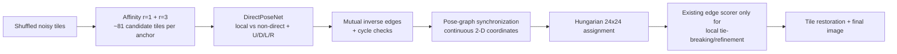

# Новая стратегия: direct pose graph для сборки PAZZLE

> Обновление, 2026-07-10: исходный `DirectPoseNet` **не прошёл** edge gate.
> После 2,000 шагов он давал лишь около `0.46` точности reciprocal
> направленных рёбер на high-confidence срезе. Ниже описанная direct-pose
> ветка сохранена как отрицательный эксперимент; текущая активная стратегия
> в конце документа — **candidate-matched listwise seam ranking**.

## Цель

Восстановить перестановку 576 фрагментов (`24 x 24`, тайл `20 x 20`) после
независимой деградации каждого тайла, а затем применить реставрацию. Главная
задача сейчас — не улучшать пиксели по отдельности, а получить достаточно
надежный **граф направленных соседств**, из которого можно собрать глобальную
раскладку.

## Что уже установлено

### Закрытые направления

- Не найдено полезной утечки, совпадения test с train или retrieval-обхода.
- Прямая генерация целого canvas из неупорядоченного мешка тайлов
  коллапсирует к усредненной сцене и не решает перестановку.
- Абсолютные координаты (`row`, `col`) и фиксированное разбиение на `4 x 4`
  макроблоки не переносятся между сценами.
- Classifier 2x2 блоков не пережил candidate-distribution mismatch: хорошие
  synthetic негативы не означали хорошее ранжирование среди кандидатов,
  предложенных edge scorer-ом.

### Положительный диагностический результат

Если дать существующему edge scorer-у **истинные группы по 16 тайлов**, он
собирает локальные `4 x 4` пазлы: placement около `0.68`, внутренняя точность
соседей около `0.72`. Значит, иерархическая сборка в принципе жизнеспособна;
узкое место — получение надежных локальных связей без оракула.

## Новый найденный сигнал: learned candidate graph

Вместо предсказания абсолютной клетки обучены два permutation-equivariant
энкодера полного тайла. Они отвечают лишь на вопрос: «какие другие тайлы
выглядят пространственно близкими в той же исходной картинке?»

- `r=1` encoder: учится на непосредственной Chebyshev-близости.
- `r=3` encoder: учится на более широком локальном контексте.
- На inference берется top-64 у каждого, затем их уникальное объединение.

Строгая проверка на 32 свежих synthetic held-out пазлах:

| Candidate graph | Recall ближайших соседей (Cheb<=1) | Precision | Среднее число кандидатов |
| --- | ---: | ---: | ---: |
| raw z-normalized pixels, top-64 | 0.2609 | 0.0303 | 64 |
| learned `r=1`, top-64 | 0.5477 | 0.0638 | 64 |
| learned `r=3`, top-64 | 0.5083 | 0.0592 | 64 |
| union `r=1 + r=3` | **0.5992** | 0.0559 | **81.3** |

Более важный разрез по четырем настоящим прямым соседям (`up/down/left/right`)
на отдельном 16-image audit: в union присутствует **67.4%** реальных
направленных прямых ребер. Для диагоналей и дальних смещений coverage заметно
ниже. Это делает прямое соседство правильной первой геометрической целью.

Важно: graph пока **не является assembler-ом**. Он лишь сокращает число
проверяемых пар примерно с 332 тысяч до ~47 тысяч направленных пар на
изображение и сохраняет большую часть наиболее полезных ребер.

## Рабочая стратегия

### Stage 1 — candidate pruning (готов)

Фиксируем два affinity checkpoint и не считаем trainable scorer для всех
`576 x 575` пар. Берем deduplicated union их top-64 списков. Важно, что
следующий classifier учится именно на этом распределении hard candidates, а
не на легких случайных негативных парах.

### Stage 2 — DirectPoseNet (сейчас в реализации)

Для упорядоченной пары `(tile_i, tile_j)` модель видит **полные** два тайла,
включая raw RGB и exposure-normalized представление. Она решает иерархически:

1. `direct` или `non-direct`;
2. если `direct`, одно из четырех смещений:
   `(-1,0)`, `(1,0)`, `(0,-1)`, `(0,1)`.

`non-direct` объединяет диагонали, расстояния 2–3 и далекие тайлы. Это
намеренно проще, чем прежняя 49-классовая постановка: прямые связи имеют
лучшую candidate coverage и именно они задают структуру обычного пазла.

Loss тоже иерархический:

- balanced binary loss для `direct/non-direct`;
- conditional 4-way cross-entropy только на истинно прямых парах;
- balanced/inverse-frequency sampling, поскольку в исходном candidate pool
  прямых ребер лишь около 3.2%.

Так избегаем ошибки плоского softmax, в котором один класс `far` выигрывал у
48 редких направлений даже при формально сбалансированном batch.

### Stage 3 — строгий edge gate

На свежих exact-synthetic held-out изображениях измеряем не только loss:

- precision/recall/F1 для `direct`;
- точность конкретного направления `U/D/L/R`;
- precision и coverage взаимных inverse-ребер;
- устойчивость при threshold по confidence.

Продолжать к глобальной сборке разумно только если после reciprocal filtering
есть одновременно высокая точность (ориентир: `>= 0.75`) и ненулевая
покрываемость существенной части настоящих прямых ребер. Иначе не будем
маскировать слабый edge model сложным optimizer-ом.

### Stage 4 — глобальная сборка, только если edge gate пройдет

Оставляем высокоуверенные взаимные ребра; для них известны векторы
`(+/-1,0)` и `(0,+/-1)`. Затем:

1. отбрасываем противоречивые короткие циклы;
2. решаем robust pose-graph synchronization для непрерывных координат;
3. переводим координаты в уникальные клетки `24 x 24` Hungarian assignment-ом;
4. применяем существующий edge scorer только внутри малых неоднозначных
   областей — как refine, а не как генератор глобальных кандидатов.

Ключевые end-to-end gates: affine coordinate `R2`, neighbour accuracy,
placement accuracy и затем SSIM после реставрации. Целевой ранний минимум для
новой ветки — neighbour accuracy `>= 0.25`; ниже этого ветку закрываем.

### Stage 5 — реставрация и проверка

После фиксации перестановки собираем изображение и используем denoiser /
реставрационный этап. Структурные метрики всегда считаются только там, где
есть exact synthetic permutation; SSIM на реальных train-парах остается
финальной проверкой качества, но не источником шумных pseudo-labels.

## Текущий статус

- Candidate ensemble: **пройден**. На 32 held-out synthetic puzzles он
  сохраняет `59.9%` ближайших и около `67%` прямых cardinal-соседей.
- 48-way multi-offset и `DirectPoseNet U/D/L/R + non-direct`: **закрыты как
  standalone edge solver**. Иерархический loss исправил collapse в `far`, но
  не дал достаточной precision для reciprocal graph.
- Per-tile MatchDenoiser улучшает L1 (на одном контрольном пазле
  `0.07935 -> 0.07178`), но seam ranking почти не меняет; denoise-first не
  является основной веткой.
- Старый PairwiseNet, ограниченный affinity candidate pool, впервые дал
  полезный сигнал: reciprocal row-z edges на двух пазлах имеют precision
  `0.7606`, но coverage всего `0.0734`. Greedy slot matching поднимает
  precision примерно до `0.86` на одном пазле, но оставляет coverage `0.079`;
  это только локальные seeds, не глобальный pose graph.
- Candidate-conditioned 2x2/C4 coverage при бюджете 128 мотивов на anchor
  составил лишь `0.0189`, поэтому C4-model поверх этого pool пока закрыта.
- **Активная ветка:** компактный oriented seam ranker с listwise loss по
  полному hard candidate list. Он обучается выбирать истинного соседа среди
  тех же affinity кандидатов, с которыми встретится при inference.

## Чего пока нет

Нет оснований заявлять, что пазл уже решен end-to-end. Самый сильный
достигнутый результат — мы нашли и измерили candidate graph, который резко
лучше raw similarity и сохраняет две трети наиболее ценных прямых связей.
Следующая проверка должна показать, достаточно ли информации в полном pair
classifier-е, чтобы превратить этот recall в точные направленные ребра.

## Актуальный следующий gate: candidate-matched listwise seam ranking

Новая модель не классифицирует отдельную пару как `far/non-far`. Для каждого
тайла и направления (`U/D/L/R`) она получает весь deduplicated affinity list
(обычно около 81 hard candidates), приводит все предполагаемые швы к одному
каноническому физическому layout и учится listwise cross-entropy: истинный
сосед должен оказаться выше всех ложных кандидатов этой же строки.

Это меняет именно источник предыдущей ошибки: старые модели учились на
случайных/независимых парах, тогда как inference требует ранжирования похожих
локальных ложных тайлов. Training и validation используют один и тот же
frozen graph builder, а строки без истинного кандидата честно исключаются из
supervision.

Продолжать к assembly можно только если held-out listwise gate одновременно
даст высокий `R@1/R@5` по покрытым строкам и reciprocal exact-edge graph с
precision не ниже `0.75–0.80` при существенно большем coverage, чем текущие
`~0.07`. Без этого Hungarian/pose synchronization не запускаются.

## Результат гейта listwise seam ranking (2026-07-10, вечер)

Реализация завершена и первый полный гейт прогнан. Полный протокол со всеми
таблицами (кривая обучения, per-image свипы, pose sync, сравнение с
базлайнами) — в `RESULTS_CANDIDATE_RANK_GATE.md`.

- Обучение: `src/train_candidate_rank.py`, tag `rank_v1`, 2,000 шагов,
  bs 2 x 48 строк/картинку, полный union-граф top-64+top-64.
  Два инфраструктурных фикса сделали шаг тренировки `~0.8 s` вместо `~19 s`:
  1. gradient checkpointing по чанкам в `score_candidate_rows` (раньше шаг
     держал ~9.8 GB активаций и выпадал из 8 GB VRAM в WDDM-подкачку);
  2. паддинг хвостового чанка до константной формы (cudnn.benchmark заново
     автотюнился на каждый новый размер остатка — многосекундный стойл
     каждый шаг).
- Гейт: новый `src/eval_candidate_rank.py` — скорит все `576 x 4` строки,
  строит mutual-argmax граф, RSCM slot-capacity, свип по порогу уверенности,
  затем IRLS pose sync + Hungarian (переиспользует `eval_offset_pose`).

Pooled по 4 свежим exact-synthetic held-out пазлам (checkpoint step 1600,
conditional `R@1=0.24`, `R@5=0.47` на покрытых строках):

| confidence floor | precision | true-edge coverage | edges/img |
| --- | ---: | ---: | ---: |
| 0.00 (все mutual) | 0.44 | 0.107 | 267 |
| 0.30 | 0.74 | 0.083 | 124 |
| 0.50 | 0.87 | 0.055 | 70 |
| 0.70 | 0.94 | 0.030 | 35 |

Pose sync на этих рёбрах: крупнейшая компонента `~1.8%` тайлов, whole-puzzle
neighbour accuracy `0.006` (стоп-порог ветки `0.25`).

**Вердикт: гейт в исходной формулировке НЕ пройден.** Кривая
precision/coverage лишь незначительно доминирует старый PairwiseNet-базлайн
(`0.76 @ 0.073`): при том же precision coverage выросла примерно на 10-15%,
а не кратно. Listwise-постановка исправила candidate mismatch (conditional
`R@1` вырос с шумового уровня до `0.24`), но сигнала шва после пофрагментной
деградации по-прежнему не хватает для плотного reciprocal-графа.

Последняя переменная ветки — ёмкость/бюджет — проверена контрольным раном
`rank_v2w64` (width 64, 646k параметров, 4x FLOPs): held-out кривая вышла на
плато к шагу 1,600-2,800, полный гейт дал `p=0.745 @ cov 0.092` (нужно было
`cov >= ~0.2`), pose sync neighbour `0.008`. **Ветка закрыта как standalone
edge solver** — все переменные (постановка, ёмкость, бюджет) проверены;
потолок общий с MGC/PairwiseNet/DirectPoseNet, т.е. лежит в данных.

Активы, которые переживают закрытие: **seeds `p=0.954` x 49 рёбер/картинку**
(и `p=0.88` x 84) от `rank_v2w64_best.pt`, affinity-union граф (recall
~0.67-0.69), сам обученный seam cross-encoder и гейт-инфраструктура
`eval_candidate_rank.py`. Полный протокол: `RESULTS_CANDIDATE_RANK_GATE.md`.
