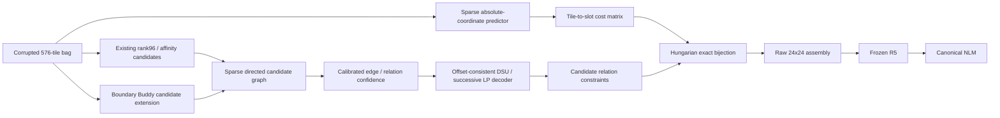
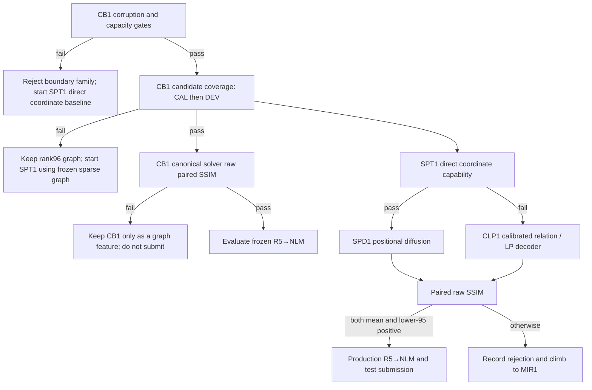

# ORBIT-24: Research-Grounded Solver Pipeline for 24×24 Fixed-Orientation Puzzle Assembly

**Author:** Manus AI  
**Date:** 14 August 2026  
**Objective:** Improve the **actual assembly** of 576 unrotated 20×20 RGB tiles under severe independent per-tile corruption, while retaining the verified S1 production baseline of **0.23748525732559034 mean SSIM**.

> **Decision.** The next work must not re-score the existing rank96 layouts. It must introduce either (a) new, calibrated directional compatibility evidence or (b) a new absolute-position representation. The first concrete experiment is a matched-corruption, informed-hard-negative *boundary buddy* candidate-extension model. It is the cheapest new source of evidence and establishes the sparse graph required for a scalable positional model.

## 1. Problem and non-negotiable constraints

The task is a Type-1 square jigsaw: every 480×480 input contains a random permutation of **576 fixed-orientation tiles** in a 24×24 lattice. Every tile receives an independent brightness change, contrast change, strong Gaussian noise, 3×3 blur, and JPEG compression. Therefore, raw boundary continuity is not stable across tiles. The evaluation metric is mean image SSIM, which makes reconstruction quality—not an internal edge score—the final authority.

| Constraint | Required treatment |
|---|---|
| Tile transformation | Only permutation; no rotation, reflection, crop, or invented tile content in the solver stage. |
| Data partition | 5,360 FIT / 670 CAL / 670 DEV / 300 reserve, source-disjoint pinned manifest. |
| GPU | One local RTX 2070. No concurrent GPU jobs; use FP32 for MS-SSIM. |
| Storage | Model/cache/output artifacts only on `E:\pazzle_work\pazzle_fixed_orientation_20260813\`. |
| Validation | Targets stay closed until the gate that explicitly authorizes them. A raw-layout gain must precede R5→NLM evaluation and any test/submission work. |
| Production comparator | S1: canonical rank96 layout → frozen R5 → canonical NLM; platform SSIM = **0.23748525732559034**. |

## 2. Local evidence audit

The experiment history rules out three seductive but unproductive directions. First, R8 demonstrated that a large joint pair-CNN can learn synthetic pair discrimination yet still fail to transfer to the raw rank96 graph: its R8∪rank96 width-128 union covered only **66.08%** of true neighbours, below the required 73%. Second, R9 showed that adapting such a model on 17 FIT raw-cache bags was not a remedy: raw CAL R@20 was **3.17%**. Third, R10-A and R11 prove that better selection of the *same* graph cannot be assumed to mean better assembly.

| Experiment | Gate result | Measured evidence | Retained conclusion |
|---|---|---:|---|
| R2L / U1 | Candidate union retained | U1 direct coverage **73.95%** | Directional retrieval contributes genuine complementary candidates. |
| R8 | Synthetic capacity pass; raw transfer reject | Synthetic R@20 **58.80%**; raw union coverage **66.08%** | Broad synthetic pair learning is not raw-domain compatible. |
| R9 | Reject | Raw CAL R@20 **3.17%** | A tiny real cache cannot repair the representation. |
| R10-A | Reject at paired DEV | raw objective **+4.190589**; raw SSIM delta **−0.002510458**, lower-95 **−0.006607833** | Raw rank96-logit sum is not a valid global assembly objective. |
| R11 | Reject at paired DEV | selected canonical candidate on **8/8** DEV; mean/lower-95 delta **0** | Rank normalization + 2×2 loop score is a no-op on the existing 32-layout ensemble. |
| R5 / S1 | Production retained | platform SSIM **0.23748525732559034** | Restoration is valuable, but it must not mask solver regressions. |

The code audit also found an earlier untracked E22–E26 posegraph/contextual-relation branch. Its preflight and signed-offset DSU validation machinery is useful, but it is **not a completed scientific result**. E24 reports `frozen_preflight_only`; it reused earlier scenes and cannot be imported as validation evidence. Its implementation ideas may be re-used only under the current source-disjoint split and fresh gates.

## 3. External research: what transfers and what does not

Classical and modern research points to the same separation: estimate reliable evidence, then enforce a globally valid assignment. The literature does **not** justify applying a single large off-the-shelf diffusion model to this task without capability gates: published puzzle benchmarks are materially smaller or cleaner than 24×24 tiles corrupted independently.

| Method family | Research finding | Transfer decision |
|---|---|---|
| Best-buddy / learned adjacency | DNN-Buddies trains an adjacency estimator using *informed* hard negatives chosen from plausible boundary matches; high precision is more important than all-pair classification accuracy [1]. | **Adopt first.** It directly answers R8/R9’s failure to learn useful raw-domain compatibility. |
| Consensus loops | Growing Consensus argues that geometric grid/loop agreement is less fragile than optimizing all pairwise scores [2]. | **Conditional use only.** R11 already tested a score-only loop selector and it did nothing. Revisit only after compatibility/candidates change. |
| Successive LP | The LP solver uses globally coupled weighted-L1 relative-position relaxations and iteratively removes inconsistent matches [3]. | **Adopt as a decoder candidate**, but only if weights arise from calibrated high-precision relations—not rank96 logits. |
| Positional Diffusion | Positional Diffusion models a shuffled set as graph nodes, denoises continuous 2-D coordinates, and maps predictions to grid slots; zero-centred inference was more stable in the paper [4]. | **Adopt after sparse-coordinate capability baseline.** A 576-node sparse graph is feasible; the dense clean 6–12 grid paper is not direct evidence for the target task. |
| DiffAssemble | Graph diffusion reaches 900 pieces with sparse graphs and reports reduced memory; its own README notes WikiArt can still favour optimization-based approaches [5]. | **Adopt sparsity principle.** Do not copy rotation/continuous-pose machinery into a fixed-grid problem. |
| Diffusion ViT | Conditional diffusion over positional tokens targets joint location recovery, including masked puzzles [6]. | **Use as a later architecture option.** Its released code expects multi-GPU training; begin with compact sparse graph models on RTX 2070. |
| Corruption benchmark | Standard solvers degrade rapidly under corrupted pieces; fine-tuning with matched augmentation is the indicated route for learning models [7]. | **Mandatory.** Train with the exact independent challenge corruption distribution, not generic synthetic augmentations or a small raw cache. |
| Mental image / retrieval | GANzzle reconstructs a global latent image from the bag then performs assignment to generated spatial slots [8]. | **Reserve experiment.** It is a viable absolute-position family but high risk for per-tile photometric corruption. |

## 4. Target architecture: evidence → geometry → bijection → restoration

The proposed pipeline deliberately separates the things that prior failures conflated.

The decisive design choice is that **candidate evidence, coordinate evidence, and bijection enforcement are separately measurable**. A learned score that is not calibrated or does not increase candidate coverage fails before it can move a layout. A coordinate model that does not improve placement fails before it can be fused with edges. R5 and NLM remain locked out until the raw solver clears paired DEV SSIM.

## 5. Prioritized experiment matrix

The matrix is intentionally diverse. No experiment is allowed to change post-processing or write a test output before clearing its raw-layout gates.

| Priority | ID | Family | Causal mechanism | Early success metric | Falsification / stop condition | RTX 2070 cost |
|---:|---|---|---|---|---|---|
| 1 | **P1 / CB1** | Matched-corruption Boundary Buddies | Exact per-tile corruption + hard false candidates force a small directed edge model to learn surviving boundary structure; new top-K candidates raise true-neighbour coverage and provide high-precision anchors. | On source-disjoint synthetic CAL: directional R@20 / union coverage exceeds frozen rank96/R2L union by **≥2 pp**, with top-1 buddy precision ≥ baseline. | No coverage lift, or raw CAL fails to transfer. Stop before any global solver. | Low–medium; 1–3 h capacity, then bounded train. |
| 2 | **P1b / CBR1** | Calibrated relation verifier | Gradient/L1/MGC-style handcrafted edge bands plus CB1/rank96 scores, reciprocity, margins and 2×2 context distinguish trusted relations from plausible false joins. | Precision of retained candidate relations at fixed recall; offset-consistent component coverage. | Cannot beat rank96 best-buddy precision or no nontrivial trusted graph. | CPU-dominant/low GPU. |
| 3 | **P2a / SPT1** | Sparse Position Transformer, direct coordinates | Candidate-neighbour attention gives every tile global context through a sparse graph; coordinate regression learns where components belong. Hungarian converts continuous costs to an exact bijection. | FIT/CAL tile-to-slot accuracy and raw SSIM beat canonical layout. | Does not exceed random/canonical coordinate baseline under matched corruption. | Medium; batch-size capability gate first. |
| 4 | **P2b / SPD1** | Sparse Positional Diffusion | Denoising normalized 2-D coordinates from zero, conditioned on tile + sparse candidate features, can correct multi-modal spatial uncertainty that one-shot regression cannot. | Slot accuracy and paired raw SSIM improvement over SPT1. | No gain over direct position predictor at equal capacity. | Medium–high; DDIM 16–32 steps, FP32. |
| 5 | **P3 / CLP1** | Calibrated successive LP / DSU decoder | Calibrated relations become weighted offset constraints; global weighted-L1 and conflict removal retain consistent components without treating raw rank logits as truth. | Component relation precision / correct-neighbour delta; then raw paired SSIM. | Solver cannot improve over exact Hungarian coordinate assignment or introduces conflicts. | Low CPU. |
| 6 | **P4 / MIR1** | Coarse mental-image retrieval | A bag encoder estimates a global low-resolution canvas; tile-to-slot similarities create an independent absolute-position cost matrix. | Coarse tile-to-slot top-K accuracy above chance and orthogonal error pattern to SPT1. | Canvas is uninformative under independent corruption. | Medium–high. |

## 6. First experiment specification: P1 / CB1

P1 is selected before positional diffusion because it is a direct, low-cost source-of-evidence experiment. It does not re-rank layouts: it attempts to change the candidate graph itself. It also provides the sparse graph required by P2.

### 6.1 Hypothesis

> Training a directional boundary compatibility model on **all FIT sources**, with exact independent challenge-style corruption and rank96/MGC/L1-informed hard false neighbours, will add genuine true neighbours beyond the frozen rank96/R2L union and improve raw layout quality after an unchanged canonical solver.

The model sees no source identity and no target image at inference. For each clean FIT source sampled online, the training generator splits into tiles and independently applies brightness ±30, contrast 0.70–1.30, noise σ 40–55, 3×3 blur, and JPEG 35–50 to each tile. Positives are physical directed neighbours. Negatives are drawn preferentially from the frozen rank96/R2L top candidate lists, MGC/L1 hard nearest candidates, and reciprocal confusers; random easy negatives are capped only for class balance.

### 6.2 Architecture

CB1 is intentionally smaller and more causal than R8. It consumes only an ordered four-column/row boundary band from the directed anchor/candidate pair, plus robust per-tile local normalization. A shallow directional 1-D/2-D convolutional verifier produces a logit. It is trained with a listwise ranking objective over each anchor-direction hard set, an auxiliary focal/BCE verification term, and a reciprocal consistency regularizer. No full-board targets, semantic image model, or postprocessor are involved.

The output is not a new global energy. It contributes a **candidate source**: CB1 top-32 per direction is unioned with unchanged rank96 and R2L sources, deduplicated, then capped only after the true-edge coverage measurement. Candidate source provenance and every top-K list are hashed.

### 6.3 Gates

| Gate | Permitted data | Pass condition | On failure |
|---|---|---|---|
| CB1-G0: corruption contract | FIT inputs only | Independent per-tile transform ranges, fixed orientations, pair labels and no self/duplicate candidates validated. | Stop; repair harness only. |
| CB1-G1: FIT capacity | small frozen FIT subset | Hard-negative listwise retrieval exceeds the rank96-only reference on generated held-out corrupt instances. | Stop; no full training. |
| CB1-G2: CAL candidate graph | CAL inputs and permutations/known label metadata, no targets | Mean true-neighbour coverage of `rank96 ∪ R2L ∪ CB1` improves over frozen union by **≥2 pp**, no board/SSIM opened. | Reject CB1 before solver. |
| CB1-G3: DEV graph | 8 pinned DEV label metadata only | Replicate a positive coverage gain and maintain candidate-density cap. | Reject before target images. |
| CB1-G4: DEV raw layout | same 8 DEV, targets after layouts frozen | Canonical solver with augmented candidates has paired mean raw SSIM delta >0 and lower-95 >0. | Reject before R5/NLM/test. |
| CB1-G5: production path | only if G4 passes | Paired R5→NLM delta >0; then 700 test outputs and ZIP. | Retain raw improvement only; no submission. |

## 7. Positional branch specification: SPT1 then SPD1

A diffusion model is a **second-generation architecture**, not the first line of code. P2a first establishes whether absolute positioning is learnable under this task’s corruption with a simpler deterministic model.

Each tile is encoded by a compact 20×20 CNN. Graph edges are the fixed union of rank96/R2L/retained CB1 candidate directions, plus a small number of learned global landmark edges. A sparse graph transformer predicts normalized coordinate mean and uncertainty. Its assignment decoder forms a 576×576 tile-to-grid-cell cost matrix from predicted coordinate distance and uncertainty, then calls Hungarian to force a bijection. Training uses FIT only: coordinate Huber/NLL, assignment/Sinkhorn auxiliary loss, and optional local edge consistency weighted by calibrated CB1 confidence.

If SPT1 demonstrates a reproducible coordinate and raw-layout gain, SPD1 replaces only the coordinate head with a zero-centred coordinate diffusion process. It uses 16–32 DDIM steps rather than a 1,000-step image diffusion process, and sparse attention rather than all-pairs attention. This retains the mechanism of positional diffusion [4] while respecting a single RTX 2070.

## 8. Experimental governance and anti-overfit policy

The pipeline makes failure informative. FIT trains weights; CAL chooses a single declared threshold, K, or scalar blend; DEV is touched only after the candidate/position model and hyperparameters are frozen. The eight current pinned DEV images retain their role for short paired gates. Any model retained from those gates requires a larger source-disjoint confirmation before a production claim, with the 670 DEV and 300 reserve pools used according to a pre-registered plan.

| Forbidden shortcut | Rationale |
|---|---|
| Selecting model/checkpoint on DEV SSIM | Turns a paired gate into an optimization dataset. |
| Reusing raw edge-logit sums as LP/DSU weights | R10 disproved their objective alignment. |
| Fine-tuning from a tiny raw-bag cache | R9 disproved this transfer strategy. |
| Applying R5/NLM before a raw solver pass | Can hide a layout regression. |
| Mixing old E22–E26 scenes with the pinned ORBIT split | Breaks source-disjoint provenance. |
| Storing caches/checkpoints on C: | Violates the storage constraint and risks the local environment. |

## 9. Expected decision tree

## 10. References

[1] D. Sholomon, E. David, N. Netanyahu, “DNN-Buddies: A Deep Neural Network-Based Estimation Metric for the Jigsaw Puzzle Problem,” 2017. https://arxiv.org/html/1711.08762

[2] K. Son, D. Moreno, J. Hays, D. Cooper, “Solving Small-Piece Jigsaw Puzzles by Growing Consensus,” CVPR 2016. https://www.cv-foundation.org/openaccess/content_cvpr_2016/html/Son_Solving_Small-Piece_Jigsaw_CVPR_2016_paper.html

[3] R. Yu, C. Russell, L. Agapito, “Solving Jigsaw Puzzles with Linear Programming,” 2015. https://arxiv.org/abs/1511.04472

[4] F. Giuliari et al., “Positional Diffusion: Ordering Unordered Sets with Diffusion Probabilistic Models,” 2023. https://arxiv.org/html/2303.11120

[5] G. Scarpellini et al., “DiffAssemble: A Unified Graph-Diffusion Model for 2D and 3D Reassembly,” CVPR 2024. https://openaccess.thecvf.com/content/CVPR2024/html/Scarpellini_DiffAssemble_A_Unified_Graph-Diffusion_Model_for_2D_and_3D_Reassembly_CVPR_2024_paper.html

[6] J. Liu et al., “Solving Masked Jigsaw Puzzles with Diffusion Vision Transformers,” CVPR 2024. https://arxiv.org/html/2404.07292v1

[7] R. Dirauf et al., “Benchmarking Content-Based Puzzle Solvers on Corrupted Jigsaw Puzzles,” 2025. https://arxiv.org/html/2507.07828v1

[8] D. Talon, A. Del Bue, S. James, “GANzzle: Reframing Jigsaw Puzzle Solving as a Retrieval Task Using a Generative Mental Image,” ICIP 2022. https://arxiv.org/abs/2207.05634
